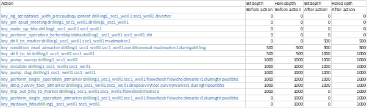

# Applications

## Analyse

Analyse a domain and problem file to give you information about type structure, relationship between arguments, overloading of predictates and functions.

## DomainView - WIP

Turn a domain into a visualisation (LaTeX document)

## HowWhatWhen

Analyse domain, problem (and plan) identifying decision making strategy of a planner.

## Instantiate

Ground the domain and problem.

## InstantiationIP

Refined veriant of instatiate.

## Parser

The PDDL Parser will find and report errors in PDDL more explicitly than validate.

Parse domain file:

`Parser <domainfile>`

Parse domain and problem file:

`Parser <domainfile> <problemfile>`

## PinguPlan

Application to create a plan for the [Pingus](https://pingus.seul.org/index.html) application

## PlanRec

Identify which action are achieving precondition of a later action in the plan.

## PlanSeqStep

Scripting of multiple plan execution and extraction of final state.

Require the planner POPEX to be in the same folder. 

Use output of PlanToValStep output

## PlanToValStep

This utility takes a plan file as input and writes out a script in the form used by ValStep, all as one output. This allows you to then run all or part of the plan through ValStep easily. The input is not XPlan format, but standard PDDL plan output.

`PlanToValStep myplan.pddl > myvalstepscript`

## Relax

Auto generation of a relaxed domain. Used to compare relax plan and real plan.

## TIM

Type Inference Mechanism (1998) tells which predicate are single value.

## ToFn

To function uses the TIM analysis to translate the domain from a predicate model to a multi-value model.

## TypeAnalysis

`TypeAnalysis <domainfile> <problemfile>`

The type-checking tool is reasonably robust at finding type errors in your PDDL domain/problem files.
Note that the PDDL parser will find and report errors in PDDL more explicitly.

## Validate

You may get to situation, when you are not sure why the planning engine is not generating the plan you are expecting. You could type the plan you expect and ask the Validator what is wrong with it. It usually tells you where are missing something like a pre-condition. 

Validate has many command line options, but the most important first few are:

`Validate -t <number> -v <domainfile> <problemfile> <planfile....>`

Multiple plan files can be handled together. The -t flag allows the value of epsilon to be set. The default value is 0.01, but 0.001 is a good value to use for most planners. Actions separated by epsilon or less are treated as simultaneous by Validate. -v is the verbose flag. 

Syntax for validating your domain model:

`Validate domain.pddl`

Syntax for validating your domain model and problem file:

`Validate domain.pddl problem.pddl`

Syntax for getting more insights into what is happening during your plan (theoretical) execution or validating a hand-coded plan:

`Validate -v -t 0.001 domain.pddl problem.pddl plan.txt`

Syntax for generating LaTeX file that visualizes the plan and changes of function values throughout the plan.

`Validate -l -f report -t 0.001 domain.pddl problem.pddl plan.txt`

The above will generate report.tex (the .tex extension is automatically added, so need not be placed on the command line).

To render the .tex file as a .pdf, download [MiKTeX](https://miktex.org/download). After you install it, its bin folder is added to your %path% and you may simply use it from a command line this way:

`pdflatex -synctex=1 -interaction=nonstopmode report.tex`

The first run will pop up a dialog asking for your consent to download additional packages needed by this .tex file. After that you should be able to just run

`pdflatex report.tex`

If you want to do the .pdf generation painlessly, you can just install the [LaTeX Preview extension for VSCode](https://marketplace.visualstudio.com/items?itemName=ajshort.latex-preview).

## ValStep

This tool is run with command line:

`ValStep <domain> <problem>`

It gives a prompt (?) and at this point several options are open.

The user types commands of the following forms:
  * start <action> @ <time>
  * end <id> @ <time>
  * x
  * q
  * w <filename>

These commands do the following: `start <action>` queues the start of the action for execution at the given time (which should be in the future!). It reports a number which is the action id code for the remainder of the plan execution. The code can be used to specify a time for the end of the same action (`end <id> @ <time>`). The command x causes the actions at the next time step to be executed. Note that the order in which action starts and ends are added is not important – it is the time that they are specified to occur that determines when the execution will simulate them happening. Also note that x will only step forward to the next time at which something is specified to happen. So here is an example:

```shell
ValStep.exe maestrobgc\maestro-cementing-casing-surface.pddl MaestroBGC\maestro-cementing-casing-surface-problem-sec1_well1.pddl
? start envelope_monitor securewellrun1_sec1_well1 @ 0
Posted action 1
? start key_make_up_wellhead_running_tool casingrun1_sec1_well1 sec1_well1 @ 0
Posted action 2
? x
Seeing 1 changed lits
timingstarts - now true
? start logistics_call_for_crews_run cementingrun1_sec1_well1 cementingcrew @ 0.001
Posted action 3
? start logistics_call_for_crews_run casingrun1_sec1_well1 casingcrew @ 0.001
Posted action 4
? start logistics_call_for_crews_run securewellrun1_sec1_well1 boptester @ 0.001
Posted action 5
? x
Seeing 1 changed lits
timingstarts - now true
? end 2 @ 2
? x
Seeing 2 changed lits
timingstarts - now true
up wellheadrunningtool - now true
? end 3 @ 4.001
? end 4 @ 4.001
? end 5 @ 4.001
? x
Seeing 5 changed lits
timingstarts - now true
up wellheadrunningtool - now true
onspotrun cementingcrew cementingrun1_sec1_well1 - now true
onspotrun casingcrew casingrun1_sec1_well1 - now true
onspotrun boptester securewellrun1_sec1_well1 - now true
?
```

Notice that the first two actions both start at time 0. Then we step past them (using x). We then post three more action starts and execute them. Then we end the second action (action 2) at time 2. Action 1 is still running, as are actions 3, 4 and 5.

The command `q` will quit the tool, causing it to print the current state as a PDDL problem file to the console output. If you wish to record the state before exiting, the command `w <file>` writes the current state (and goal) as a PDDL problem file into the indicated file.

## ValueSeq

This tool can be used to extract the values of particular functions in the state during execution of a plan. It is used as follows:

`ValueSeq <domain> <problem> <plan> [<function>*] [REMOVE <tag>*]`

where the function expressions are state variables and the tags are strings that appear in some of the action names. The square brackets indicate optional arguments and the * symbol indicates arguments that can appear any number of times.

An example is:

```shell
ValueSeq.exe MaestroBGC\maestro-drilling.pddl MaestroBGC\maestro-drilling-problem-sec1_well1.pddl plandrill1.txt bitdepth holedepth REMOVE artifact fluid logistics envelope
This command runs the planner with a domain and problem (in the Maestro dcomposed domain file set) with a plan (for this domain and problem) and requests the values of bitdepth and holedepth before and after each action, removing all actions from the output that contain the strings artifact, fluid, logistics or envelope. This generates the output:
key_rig_acceptance_with_prespudequipment drilling1_sec1_well1 sec1_well1 diverter, 0, 0, 0, 0
key_pre-spud_meeting drilling1_sec1_well1 drilling1_sec1_well1, 0, 0, 0, 0
key_make_up_bha drilling1_sec1_well1 sec1_well1, 0, 0, 0, 0
key_perform_operation_beforetripinbha drilling1_sec1_well1 sec1_well1 sht, 0, 0, 0, 0
key_drill_to_marker drilling1_sec1_well1 sec1_well1 mudmarker1, 0, 0, 500, 500
key_condition_mud_atmarker drilling1_sec1_well1 sec1_well1 conditionmud mudmarker1 duringdrilling, 500, 500, 500, 500
key_drill_to_td drilling1_sec1_well1 sec1_well1, 500, 500, 1000, 1000
key_pump_sweep drilling1_sec1_well1, 1000, 1000, 1000, 1000
key_circulate drilling1_sec1_well1 sec1_well1, 1000, 1000, 1000, 1000
key_pump_slug drilling1_sec1_well1 sec1_well1, 1000, 1000, 1000, 1000
key_perform_single_operation_atmarker drilling1_sec1_well1 sec1_well1 flowcheck flowcheckmarker1 duringtripoutbha, 1000, 1000, 1000, 1000
key_drop_survey_tool_atmarker drilling1_sec1_well1 sec1_well1 dropsurveytool surveymarker1 duringtripoutbha, 1000, 1000, 1000, 1000
key_trip_out_bha_to_marker drilling1_sec1_well1 sec1_well1 flowcheckmarker2, 1000, 1000, 0, 1000
key_perform_single_operation_atmarker drilling1_sec1_well1 sec1_well1 flowcheck flowcheckmarker2 duringtripoutbha, 0, 1000, 0, 1000
key_laydown_bha drilling1_sec1_well1 sec1_well1, 0, 1000, 0, 1000
```

The output shows changes in function values before and after an action execution. However, if you look up the action start time and duration in the plan file, you can reconstruct a temporal sequence and plot it. Mind the cases, where the same action appears in the plan more than once. 

This can be put into an Excel page:

